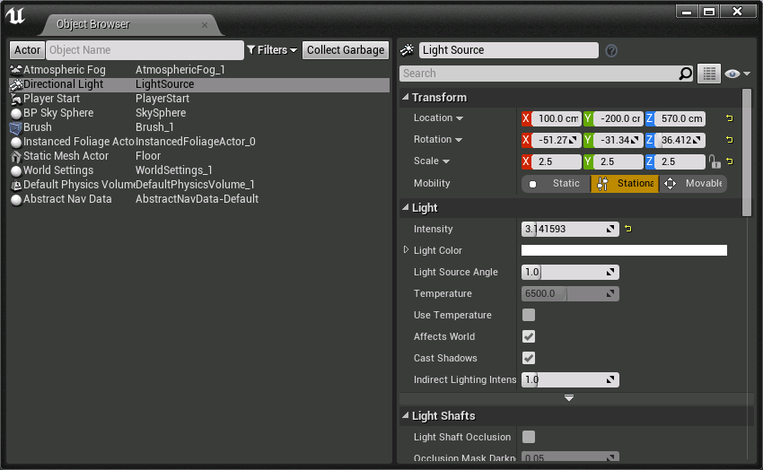

# ObjectBrowser

Unreal Engine 4 plug-in that adds a way to browse instances of UOjects in memory.

Window > Developer Tools > Object Browser

## About

The ObjectBrowser plug-in implements a module that allows you to find instances
of objects in memory.  Handy for debugging state and verifying things are correct.

## Supported Platforms

This plug-in was last built against **Unreal Engine 4.11**. It works on all
platforms.

## Dependencies

This plug-in requires Visual Studio and either a C++ code project or a the full
Unreal Engine 4 source code from GitHub. If you are new to programming in UE4,
please see the official [Programming Guide](https://docs.unrealengine.com/latest/INT/Programming/index.html)! 

## Usage

You can use this plug-in as a project plug-in, or an Engine plug-in.

If you use it as a project plug-in, clone this repository into your project's
*/Plugins* directory and compile your game in Visual Studio. A C++ code project
is required for this to work.

If you use it as an Engine plug-in, clone this repository into the
*/Engine/Plugins/Media* directory and compile your game. Full Unreal Engine 4
source code from GitHub (4.9 or higher) is required for this.

This plug-in is enabled by default, so no need to enable it in the plug-in browser.

## Support

Please [file an issue](https://github.com/nickdarnell/ObjectBrowser/issues),
submit a [pull request](https://github.com/nickdarnell/ObjectBrowser/pulls?q=is%3Aopen+is%3Apr)
or hit me up on twitter [@NickDarnell](https://twitter.com/NickDarnell)

## References

* [Introduction to UE4 Plugins](https://wiki.unrealengine.com/An_Introduction_to_UE4_Plugins)
